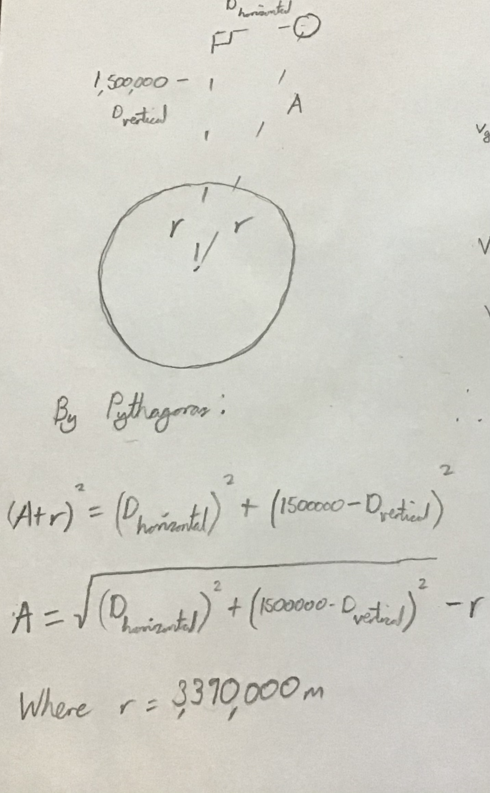

## mars_rover_project
# My entry for the Computational Physics Prize 2021

I have successfully satisfied both restrictions for the model; the velocity of the rover when it hits the Martian surface is around 1m/s, and the maximum deceleration is 

