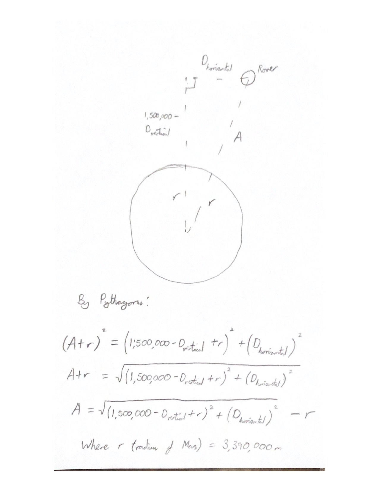
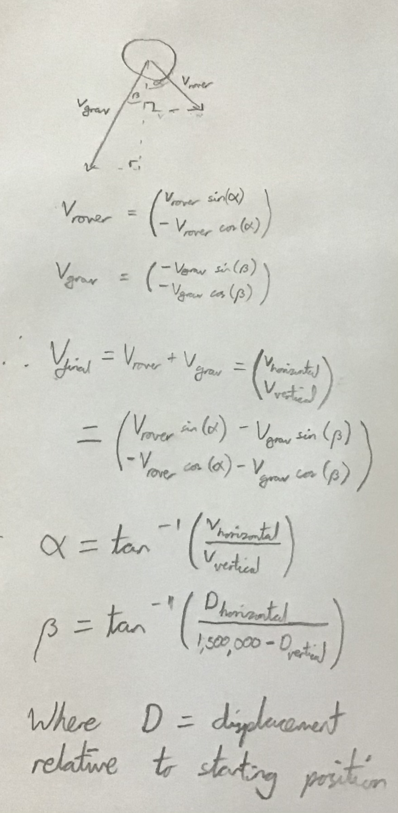

## mars_rover_project
# My entry for the Computational Physics Prize 2021

The model uses a relatively shallow angle of travel to the surface, as well as both a parachute and a rocket system to reduce both the acceleration and velocity of the rover. As a result, I have successfully satisfied both restrictions for the model; the velocity of the rover when it hits the Martian surface is around 1m/s, and the maximum deceleration is around -97m/(s^2).

Here are 2 key elements of my model that need further explanation.

# Altitude Calculation

# Vector Diagram

There are also several other elements that are key to the functioning of my model, but they are pretty simple to understand from reading the code and are 
straightforward.
